# Show me love

In de deze manual laten we 2 NodeMCU's met elkaar communiceren via Adafruit IO. Node 1 heeft een drukknop en stuurt een signaal naar een feed. Node 2 leest die feed uit en laat een ledstrip roze branden. Als extra challenge stuurt node 2 met zijn FLASH knop ook iets terug, waarna het blauwe ledje op node 1 gaat branden.

Ik heb de opdracht alleen gedaan. Daarom heb ik twee Adafruit IO accounts gebruikt: **USSCallister** voor node 1 en **SESCallister** voor node 2.

## Benodigdheden

* 2x NodeMCU 
* Drukknop module met de pinnen VCC, OUT en GND
* NeoPixel ledstrip 
* Jumper kabels
* 2x USB kabel
* Arduino IDE met de libraries **Adafruit IO Arduino** en **Adafruit NeoPixel**
* Een hotspot op 2,4 GHz
* Twee Adafruit IO accounts

## Zo werkt het

| Richting | Zender | Feed | Ontvanger |
|---|---|---|---|
| Heen | Groene knop op node 1 | `ada-love` | Ledstrip op node 2 |
| Terug | FLASH knop op node 2 | `love-back` | Ingebouwde led op node 1 |

Beide feeds zijn van USSCallister en gedeeld met SESCallister met Read + Write rechten.

## Stap 1: Account en feed aanmaken

1. Ga naar io.adafruit.com en maak een account aan via **Sign Up**.


2. Klik bovenaan op **IO**.


3. Ga naar **Feeds** en klik op **New Feed**.


4. Geef de feed een naam. Ik koos **Ada Love**.


5. Adafruit maakt van de naam automatisch een **Feed Key**: `ada-love`.


> **Let op:** de naam van de feed (Ada Love) en de Feed Key (`ada-love`) zijn niet hetzelfde. In de code gebruik je altijd de Feed Key.

## Stap 2: Drukknop aansluiten op node 1

| Knop | NodeMCU |
|---|---|
| OUT | D0 |
| GND | G |
| VCC | 3V |

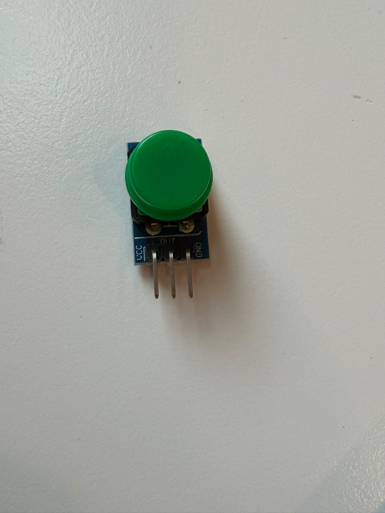
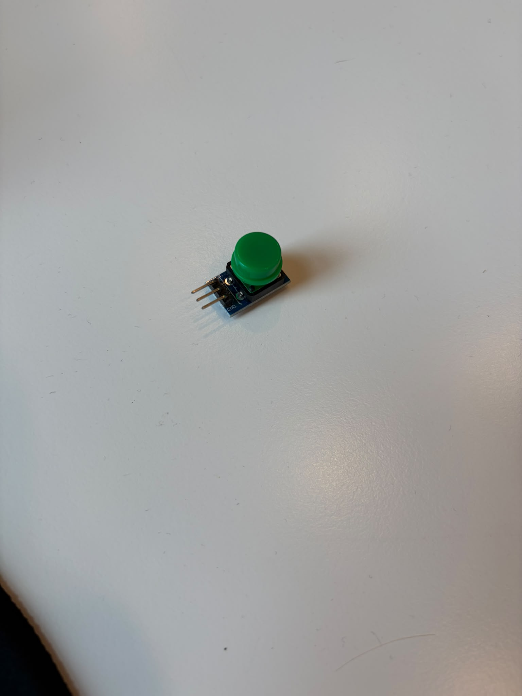
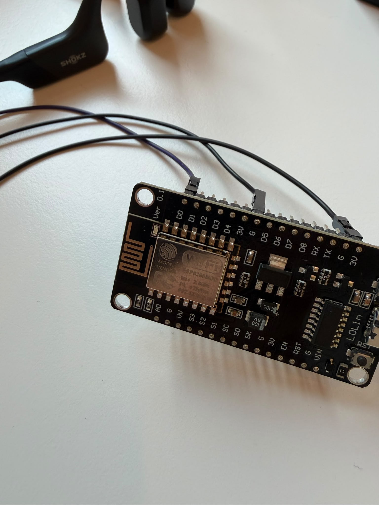
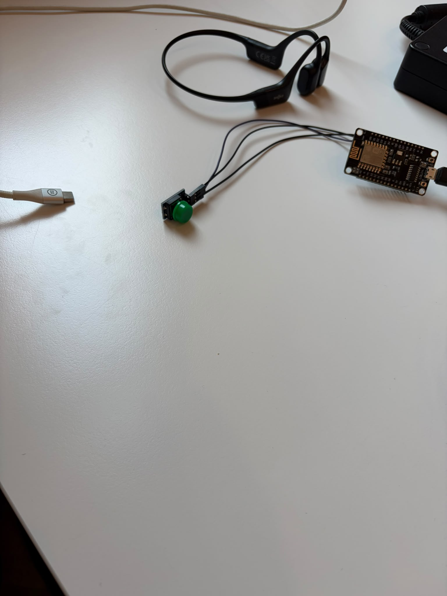

### Fout 1: Andere drukknop dan in de opdracht

**Probleem:** de opdracht beschrijft een knop met de pinnen S, min en plus. Mijn knop heeft VCC, OUT en GND.

**Oplossing:** het is dezelfde soort knop met andere namen. OUT is het signaal (S) en gaat naar D0. GND gaat naar G. VCC is de plus en gaat naar 3V. Gebruik 3V en niet VIN, want de pinnen van de NodeMCU kunnen maar 3,3 V aan.

## Stap 3: Voorbeeld openen en de knop pin aanpassen

Open **File > Examples > Adafruit IO Arduino > adafruitio_06_digital_in**.


Verander `BUTTON_PIN` van `5` naar `D0`.

Voor:


Na:


Het voorbeeld heeft twee tabbladen. Je wifi en Adafruit gegevens vul je in bij `config.h`.


## Stap 4: config.h invullen

Vul de naam en het wachtwoord van je hotspot in. Let op: de naam is hoofdlettergevoelig.

Voor:


Na:


Vul daarna je username en je **Adafruit IO Key** in.


### Fout 2: Feed Key ingevuld in plaats van de Adafruit IO Key

**Probleem:** bij `IO_KEY` vulde ik `ada-love` in. Dat is de Feed Key en niet de key van mijn account.


Het uploaden ging goed, maar in de serial monitor verschenen alleen puntjes. Als ik op de knop drukte gebeurde er niets.


**Oorzaak:** het voorbeeld wacht in `setup()` tot de verbinding met Adafruit IO gelukt is. Met een verkeerde key lukt dat nooit, dus de code in `loop()` die de knop uitleest wordt nooit uitgevoerd.

**Oplossing:** de juiste key vind je via het gele sleutelicoon rechtsboven op io.adafruit.com. Deze key begint altijd met `aio_`.


> **Tip:** zet je echte key nooit zichtbaar op GitHub. Dan kan iedereen je account gebruiken. Blur hem of genereer na afloop een nieuwe key.

## Stap 5: Uploaden en testen

Upload de code en open de serial monitor op **115200 baud**. Druk een paar keer op de knop. Je ziet nu `sending button` met een 1 of een 0.

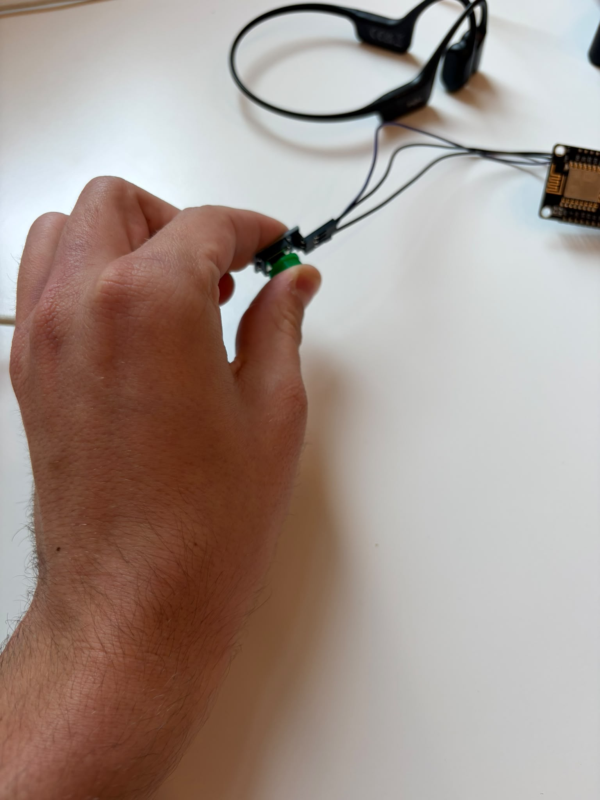


## Stap 6: Data controleren in Adafruit IO

### Fout 3: De data kwam in een feed `digital` terecht

**Probleem:** de verbinding werkte, maar mijn feed Ada Love bleef leeg. Er was ineens een nieuwe feed `digital` waarin de 0'en en 1'en wel binnenkwamen.


**Oorzaak:** in het voorbeeld staat de feednaam `digital`. Als de code naar een feed stuurt die nog niet bestaat, maakt Adafruit IO die automatisch aan.

**Oplossing:** verander de feednaam naar je eigen Feed Key.

Voor:


Na:


Nu komt de data in de goede feed binnen:


De feed `digital` kun je daarna verwijderen.

## Stap 7: De feed delen met een ander account

1. Open de feed Ada Love en klik op **Sharing**.


2. Vul bij **Email or Username** het andere account in en kies **Read + Write**. Met alleen Read kan de ander niet naar je feed schrijven.


3. Klik op **Send Invitation**. De uitnodiging staat nu op Pending.


4. Het andere account krijgt een mail en klikt op **Approve**.


### Fout 4: De uitnodiging kon niet geaccepteerd worden

**Probleem:** de link in de mail stuurde me steeds door naar de welcome page of naar mijn publieke pagina.

**Oorzaak 1:** ik opende de link in een browser waarin ik nog ingelogd was als USSCallister. De uitnodiging was voor SESCallister.

**Oorzaak 2:** het account SESCallister was wel aangemaakt, maar Adafruit IO was nog niet geactiveerd. Daardoor had het account geen Feeds menu en kon de uitnodiging nergens landen.


**Oplossing:**
1. Open een incognitovenster en log in met het tweede account.
2. Ga naar io.adafruit.com en klik onder **The Internet of Things for Everyone** op **Get Started**. Pas dan wordt Adafruit IO geactiveerd.
3. Open de link opnieuw of ga naar **Privacy & Sharing** en klik op **Approve**.

## Stap 8: De gedeelde feed uitlezen op node 2

Open **File > Examples > Adafruit IO Arduino > adafruitio_21_feed_read**.


Vul bij `FEED_OWNER` de username in van de eigenaar van de feed.

Voor:


Na:


Vul bij de feed de Feed Key in.

Voor:


Na:


### Fout 5: config.h van het nieuwe voorbeeld niet ingevuld

**Probleem:** node 2 liet alleen puntjes zien en ontving niets als ik op de knop van node 1 drukte.


**Oorzaak:** elk voorbeeld heeft zijn eigen `config.h`. In het nieuwe voorbeeld stonden nog de standaardwaardes.

**Oplossing:** vul in `config.h` de gegevens van het **tweede account** in: de username en de key van SESCallister. USSCallister staat alleen bij `FEED_OWNER`.

Voor:


Na:


Nu ontvangt node 2 de waardes van node 1:


## Stap 9: De ledstrip laten reageren

| Ledstrip | NodeMCU |
|---|---|
| DIN | D1 |
| GND | G |
| 5V | 3V |

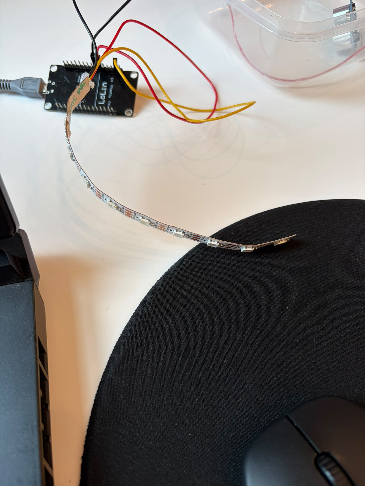

Voeg bovenaan de NeoPixel library en de ledstrip toe:

```cpp
#include <Adafruit_NeoPixel.h>
Adafruit_NeoPixel pixels(16, D1, NEO_GRB + NEO_KHZ800);
```


Start de ledstrip in `setup()`:

```cpp
pixels.begin();
```


Laat de strip in `handleMessage` reageren op de ontvangen waarde:

```cpp
if (data->toInt() == 1) {
  pixels.fill(pixels.Color(255, 0, 100));
} else {
  pixels.clear();
}
pixels.show();
```


Resultaat: zolang je de knop van node 1 indrukt, brandt de ledstrip op node 2 roze. Er zit een kleine vertraging in, omdat alles via Adafruit IO gaat.

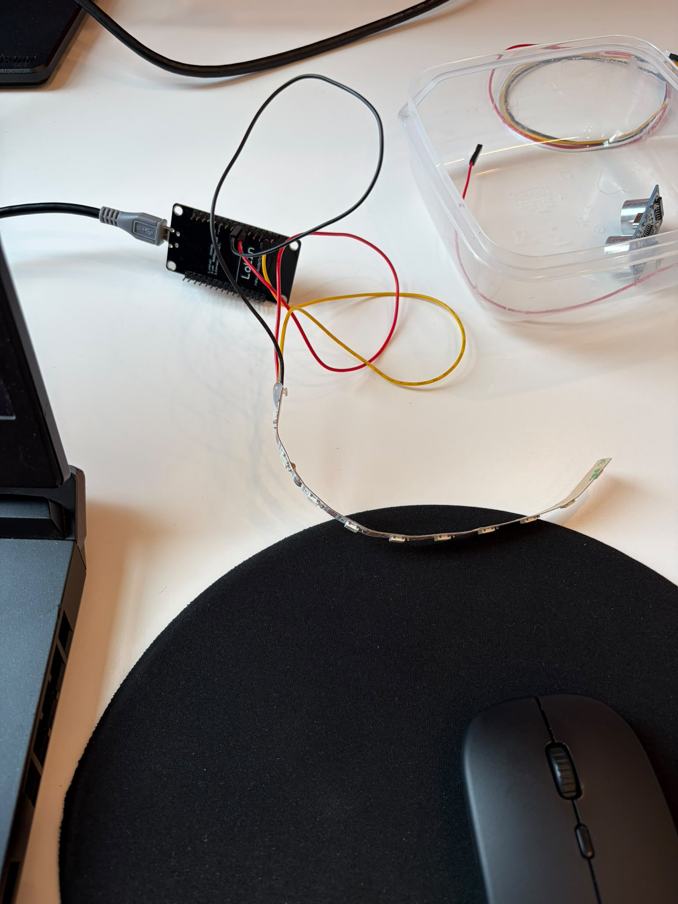
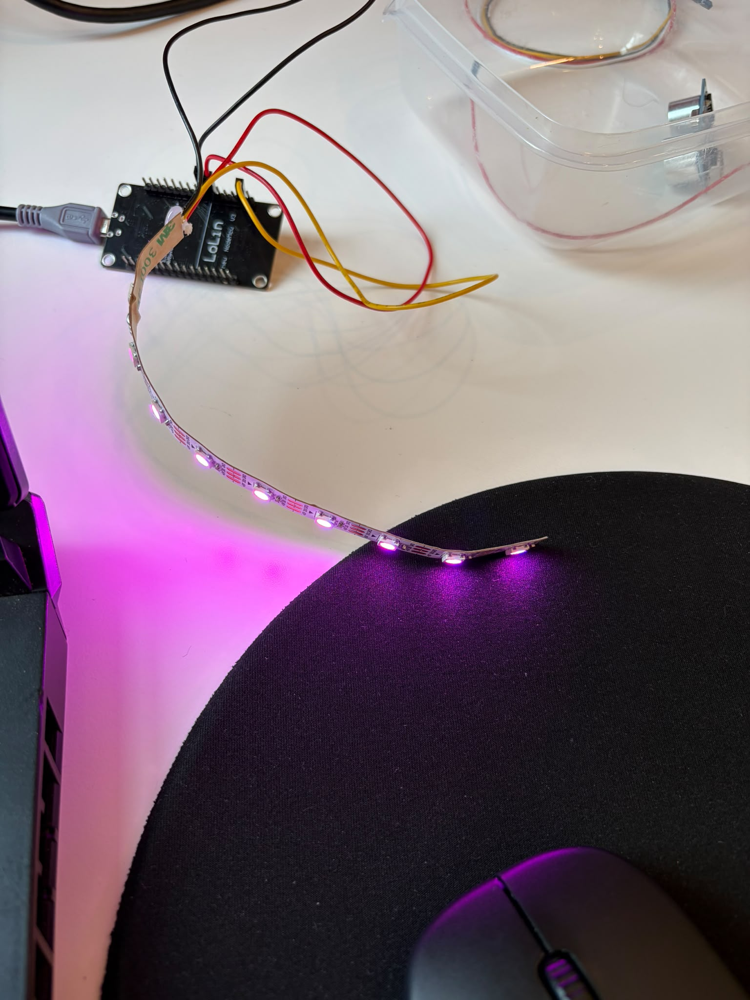

## Extra challenge: heen en weer

Ik had maar 1 drukknop en geen tweede output. Daarom gebruik ik op node 2 de ingebouwde **FLASH knop** (D3) en op node 1 het ingebouwde **blauwe ledje** (`LED_BUILTIN`).

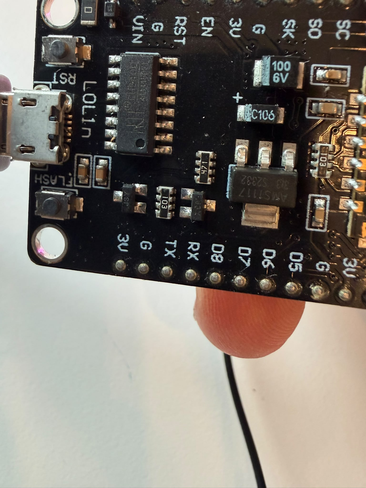

### A: Tweede feed aanmaken en delen

Maak als USSCallister een feed **Love back** aan (Feed Key `love-back`) en deel die met SESCallister met Read + Write.


### B: Node 2 laat de FLASH knop versturen

Bovenaan, bij de andere feed:

```cpp
AdafruitIO_Feed *backFeed = io.feed("love-back", "USSCallister");
bool vorige = HIGH;
```


In `setup()`:

```cpp
pinMode(D3, INPUT_PULLUP);
```


In `loop()`, onder `io.run();`:

```cpp
bool nu = digitalRead(D3);
if (nu != vorige) {
  backFeed->save(nu == LOW ? 1 : 0);
  vorige = nu;
}
```


De code stuurt alleen iets als de knop verandert. Zo blijf je onder het limiet van 30 berichten per minuut van een gratis account.

> **Opmerking:** de FLASH knop geeft 0 als je hem indrukt en 1 als je hem loslaat. Daarom draait `nu == LOW ? 1 : 0` de waarde om. Houd de FLASH knop niet ingedrukt tijdens het opstarten, want dan gaat de NodeMCU in uploadmodus.

### C: Node 1 laat het blauwe ledje reageren

Bovenaan, onder de feed `ada-love`:

```cpp
AdafruitIO_Feed *backFeed = io.feed("love-back");
```


In `setup()`, direct na `io.connect();`:

```cpp
pinMode(LED_BUILTIN, OUTPUT);
digitalWrite(LED_BUILTIN, HIGH);
backFeed->onMessage(handleBack);
```


Onderaan een nieuwe functie:

```cpp
void handleBack(AdafruitIO_Data *data) {
  if (data->toInt() == 1) {
    digitalWrite(LED_BUILTIN, LOW);
  } else {
    digitalWrite(LED_BUILTIN, HIGH);
  }
}
```


> **Opmerking:** het ingebouwde ledje werkt omgekeerd. `LOW` is aan en `HIGH` is uit. Dat is geen fout, zo is het ledje op de NodeMCU aangesloten.

Resultaat: druk je op de FLASH knop van node 2, dan gaat het blauwe ledje op node 1 branden.

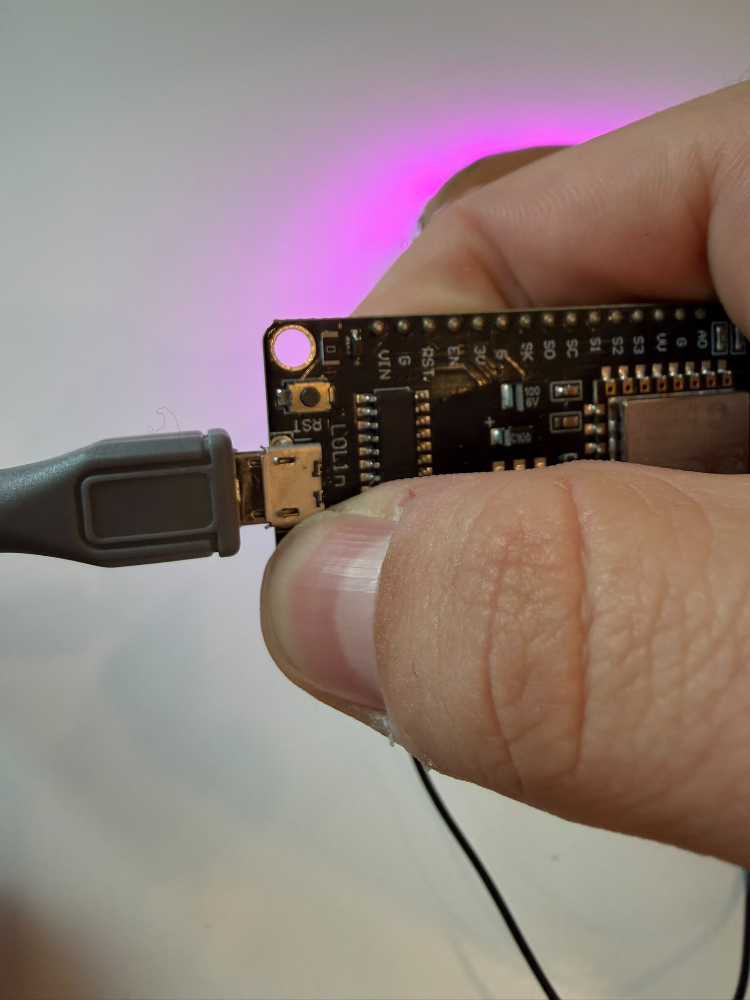

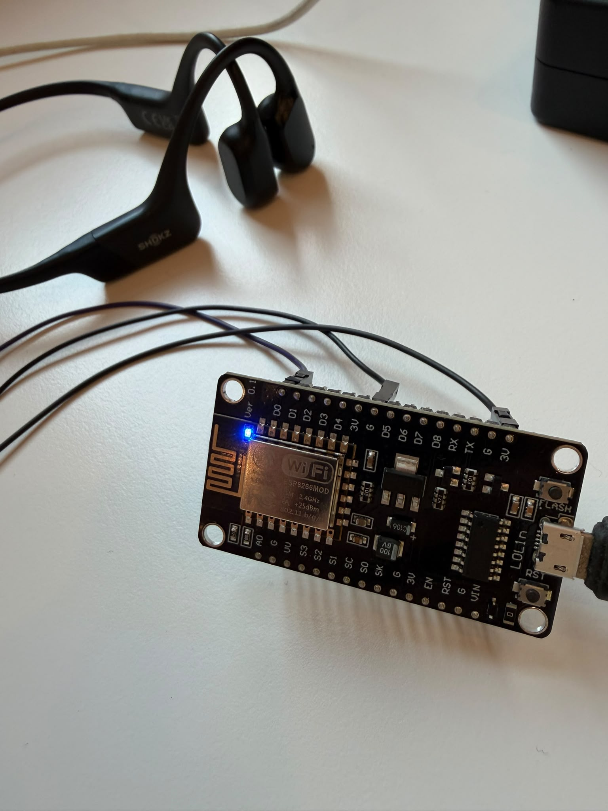

## Bronnen

* Opdracht Show me love, DfETsr IoT, HvA
* Adafruit, Sharing a Feed: https://learn.adafruit.com/adafruit-io-basics-feeds/sharing-a-feed
* Adafruit IO Arduino library en de voorbeelden 06, 20 en 21: https://github.com/adafruit/Adafruit_IO_Arduino
* Adafruit NeoPixel library: https://github.com/adafruit/Adafruit_NeoPixel
* Random Nerd Tutorials, ESP8266 Pinout Reference (FLASH knop op D3 en ingebouwde led): https://randomnerdtutorials.com/esp8266-pinout-reference-gpios/
* Claude (Anthropic), hulp met troubleshooting en code
